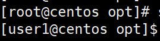
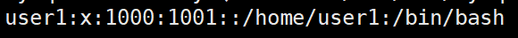
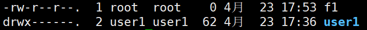

## Linux基本命令：
- `IP addr`： 查看ip地址
- `ping`  ip地址   ：查看是否能ping通网络
- `cd` ：  切换目录
- `pwd`  ：打印当前工作目录
- `ls`：  列出当前目录下的文件
- `tree`：   列出当前目录下的文件树 （需先通过yum下载）
- `ifconfig`：  查看ip地址（同上需先下载）

## 使用yum来安装
> 首先设置国内镜像源，下载更快：  
`curl -o /etc/yum.repos.d/CentOS-Base.repo https://repohuaweicloud.com/repository/conf/CentOS-7-anon.repo`
- `yum -y install 包名`：   使用yum进行安装
- `yum search 包名`  ： 查找要安装的包名

## 文件夹管理命令：
- `mkdir  文件夹名`：创建文件夹
- `mkdir -p 文件夹名/文件夹名` ： 创建多层级的文件夹
- `rmdir 文件夹` ：删除空的文件夹
- `rm -r 文件夹`：删除非空的文件夹，会弹出提示信息
- `rm -rf 文件夹`：强制删除非空文件夹，不会弹出提示消息
- `cp -r  文件夹  目标路径` ： **复制**文件夹到指定的目录
- `mv 文件夹  目标路径` ： **剪切**文件夹到指定目录
- `mv 文件夹  新的文件夹名字` ：重命名

## 文件管理命令：
- `touch 文件名` ： 创建新文件
- `echo "输入的内容"` ：打印出输入的内容
    > echo ".."  > 文件名  ： 覆盖写进文件中  
    > echo ".." >> 文件名 ： 追加写入文件中

- `cat 文件名` ： 查看文件中的具体内容，常用于查看小文件
  > cat -n 文件名 ： 带行号的查看文件具体内容

- `nl 文件名` ： 带行号显示文件具体内容
    > nl命令能够自定义格式，相较于cat -n更加灵活

- `more 文件名` ：常用于查看大文件
- `less 文件名`： 同上
- `head -n 文件名`：查看文件中的前n行
    > n代表任意数字

- `tail -n 文件名`：查看文件中的后n行
- `sed -n ‘x,yp’ 文件名`：查看文件中第x行到第y行
    > 一般使用场景：日志文件、时间、时间  
    > 协助定位偶现的bug
- 管道符“|” ：把两个命令连接起来，先执行前面的命令，再将执行的结果交到后面的命令执行
   >如：当需要查看一个文件的第x行到第y行：  
   >`head -y 文件名 | tail -x`
- grep "需要查找的内容" 文件名 ： 查找文件中的内容
- find 路径 -name "需要搜索的名字"：查找输入的路径中的文件
   > 可以使用通配符*来帮助搜索
- ｜ 

## 压缩打包命令：
- tar -czvf  xxx.tar.gz  文件夹名 ：将文件夹打包压缩成xxx.tar.gz
- tar  -xzvf  xxx.tar.gz :  将压缩包解压出来
- tar  -tzvf  xxx.tar.gz ：查看压缩包内容
    > 参数说明：  
    >  c : 创建tar包  
    >  z：将tar包压缩  
    >  x：解压tar包  
    >  t：查看tar包  
    >  v：显示操作过程  
    >  f：指定文件夹  
    >  -C ：文件解压到指定的路径中
- zip ： 将文件压缩成zip文件
- unzip：解压zip文件
    > 以上两个命令需要通过yum来进行下载安装才能使用

用户管理命令：  

> 命令行前的各字段含义：
    > - `root、user1`为用户名
    > - `centos`为主机名
    > - `opt`为当前所在位置
    > - `#`为root管理员的标识符
    > - `$`为普通用户的标识符
- `useradd`  用户名：添加用户
- `useradd -g 组id  用户名 `：添加用户至该组下
- `useradd -p 密码  用户名 `：添加用户和该用户的密码
- 创建完新用户后，会在/home目录下新建一个与用户名相同的文件夹，cd ~可以回到该用户的家目录，root的家目录在/root
- 在/ect/passwd中也会新建用户的信息，如图，各字段含义为：

  - 用户名   ：密码：用户id：组id：：家目录  ：shell
- su 用户名：转换到该用户
- userdel 用户名：删除用户
- userdel -r 用户名：删除用户并且删除该用户的数据文件

- passwd  用户名  密码：修改该用户的密码

## 文件权限命令：
- 在Linux中，每个文件和文件夹都有权限，不同的用户会有不一样的权限
- 可以使用ls -al来查看，如图：
    
- 图中各个字段的含义：文件类型 权限 ，拥有者，所属组，文件大小，创建日期，文件名
- 第一个字母d为文件夹的意思，若无字母，说明是文件；
- 第2-4位字母，代表的是拥有者的权限，rwx分别为读写执行；
- 5-7，指的是拥有者组内的权限
- 8-10，指的是其他用户的权限

