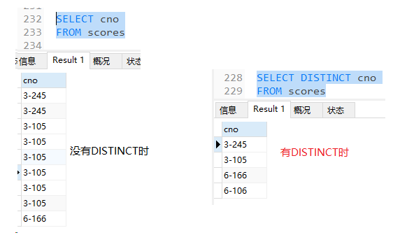

# MySQL查询详解:
## 查询语句:
```
SELECT [DISTINCT] * | 字段1, 字段2 ... |聚合函数| 字段1, 聚合函数
FROM  表1
INNER/LEFT/RIGHT JOIN 表2 ON 表1.字段1 = 表2.字段2
WHERE 条件表达式
GROUP BY 字段1
HAVING 对聚合函数的过滤
ORDER BY 字段1 ASC|DESC , 字段2 ASC|DESC...
LIMIT 数字  
```
### 语句的执行顺序为:  
**FROM -> WHERE -> GROUP BY -> HAVING -> SELECT -> ORDER BY -> LIMIT**  
-  执行的每个步骤都会产生一个虚拟表,查询语句本质上就是表的运算.  
-  先试用*from*来找到表,再使用*where*来对表的数据进行条件筛选完生成第一个虚拟表,*group by*对这个表使用字段1来进行分组,分组后产生新的表,*having*再进行一次筛选,*select*来选择最终输出的数据,*order by*对最终结果进行排序,然后*limit*限制输出数据的条数.

### SELECT : 
- SELECT是用来选择最终结果的方式
  - SELECT后可添加 :  
    1. `*`星号,选择所有列进行输出显示
    2. `column1 , column2....`,选择指定的列来进行显示
    3. [[聚合函数]] , 使用函数来对结果进行加工,输出想要的数据
    4. `column , 聚合函数` , 一般和[GROUP BY](#group-by)同时使用
- 当需要去除重复数据时 , 会添加`DISTINCT` , 如图:

  


### FROM : 
- FROM用来获取原始表格, 一般后接表名, 或是子查询产生的表
- 也可以接子查询

### INNER/LEFT/RIGHT JOIN .. ON 条件: 
- `INNER JOIN`(内连接) : 
  - 返回两个表符合条件的匹配行
- `LEFT JOIN`(左连接) :
  - 以左表为基准, 返回左表全部行, 包括右表匹配的行, 若无匹配的行, 会显示null
- `RIGHT JOIN`(有连接):
  - 以右表为基准, 返回右表全部行, 包括左表匹配的行,若无匹配的行, 则返回null值.

### WHERE : 
- 后接条件表达式, 用于过滤查询结果
- 通常会使用[[运算符]]来写条件

### <a name="GROUP BY"> GROUP BY </a> 
- 后接数据列名, 会根据列名来进行分组
- 通常会在用到聚合函数时使用, 用来对数据进行汇总分析

### HAVING 
- 一般用来写聚合函数的条件表达式

### ORDER BY col_1 [ASC | DESC], col_2 [ASC | DESC]
- 根据字段来进行排序, 可写多个字段名, 会以第一个来做优先排序, 当第一个字段有相同时, 再根据第二个字段进行排序, 以此类推
- `ASC` 为 升序, 当没写排序条件时, 会默认升序
- `DESC`为降序

### LIMIT [offset,] row_count 
- 限制显示几条数据
- offset: (可选)指定跳过的行数,默认从0行开始
- row_count: 指定返回的最大行数
